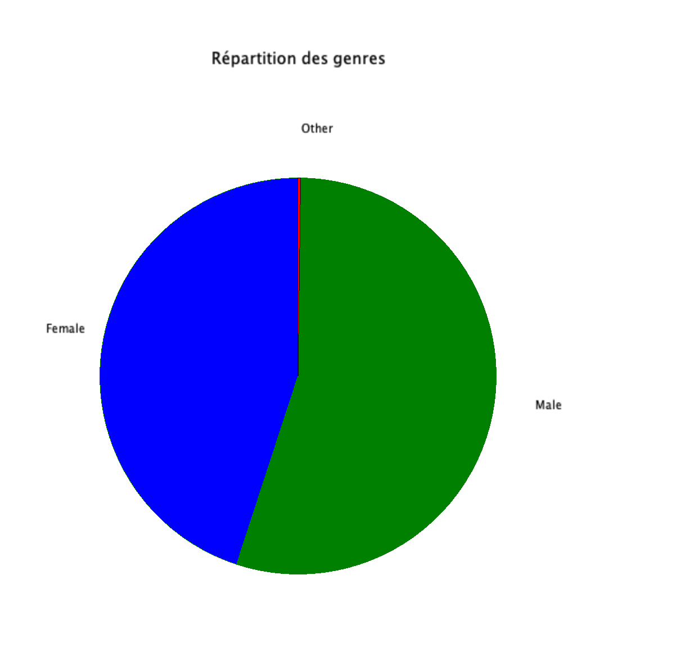
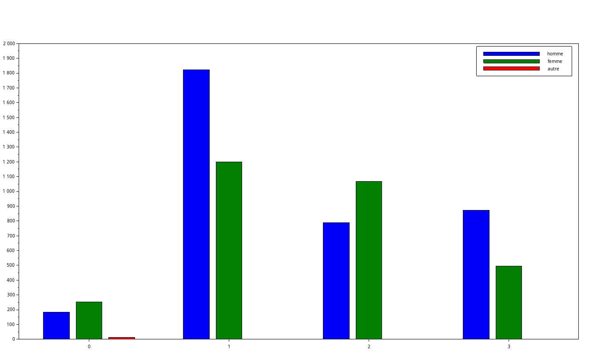
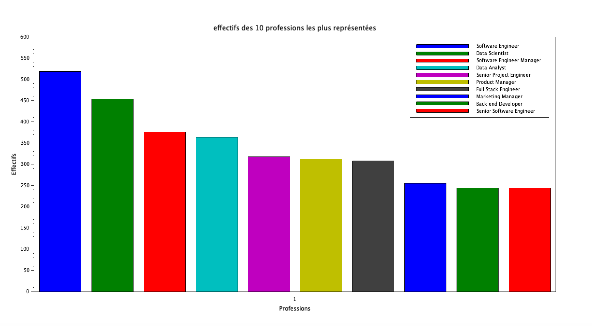

# Exercice 1 : Analyse des données démographiques et professionnelles

## Table des matières
1. [Initialisation des variables](#init)
2. [Répartition des genres](#q1)
3. [Répartition des niveaux d'études selon le genre](#q2)
4. [Effectifs des 10 professions les plus représentées](#q3)
5. [Profession la plus fréquente selon le genre](#q4)
6. [Statistiques par niveau d'études](#q5)
7. [Statistiques par genre](#q6)
7. [Nuage de points et régression](#q6)

---

## Initialisation des variables {#init}

Pour cette exercice, veuillez initaliser les variables suivantes :

**[Script Scilab](scripts/init.sce) :**

```scilab
csvDouble = csvRead("data.csv")                         //ouvre data.csv en une matrice d'entier
csvString = csvRead("data.csv",[],[],'string')          //ouvre data.csv en une matrice de string
```

---

## Question 1 : Répartition des genres {#q1}

> Donnez sous forme de camembert la répartition des genres.

**[Script Scilab](scripts/q1.sce) :**

```scilab
genre = tabul(csvString(:,3),"i")                       //récupère la liste des genres ainsi que leur occurence
pie(genre(2),genre(1))                                  //ouvre un diagramme camembert représentant les genres en fonction de leur occurence
```

**Résultat :**



---

## Question 2 : Répartition des niveaux d'études selon le genre {#q2}

> Donnez sous forme d'histogramme la répartition des niveaux d'études, suivant le genre.

**[Script Scilab](scripts/q2.sce) :**

```scilab
genre_lvl = [csvString(:,3),csvString(:,4)]                                     // crée une matrice 6699x2 avec les genres et le niveau d'études

high_homme = length(find(genre_lvl(:,2) == "0" & genre_lvl(:,1) == "Male"))     // renvoie l'occurence d'hommes ayant un niveau d'étude de 0
high_femme = length(find(genre_lvl(:,2) == "0" & genre_lvl(:,1) == "Female"))   // renvoie l'occurence des femmes ayant un niveau d'étude de 0
high_autre = length(find(genre_lvl(:,2) == "0" & genre_lvl(:,1) == "Other"))    // renvoie l'occurence des autres ayant un niveau d'étude de 0

b_homme = length(find(genre_lvl(:,2) == "1" & genre_lvl(:,1) == "Male"))        // renvoie l'occurence d'hommes ayant un niveau d'étude de 1
b_femme = length(find(genre_lvl(:,2) == "1" & genre_lvl(:,1) == "Female"))      // renvoie l'occurence des femmes ayant un niveau d'étude de 1
b_autre = length(find(genre_lvl(:,2) == "1" & genre_lvl(:,1) == "Other"))       // renvoie l'occurence des autres ayant un niveau d'étude de 1

m_homme = length(find(genre_lvl(:,2) == "2" & genre_lvl(:,1) == "Male"))        // renvoie l'occurence des hommes ayant un niveau d'étude de 2
m_femme = length(find(genre_lvl(:,2) == "2" & genre_lvl(:,1) == "Female"))      // renvoie l'occurence des femmes ayant un niveau d'étude de 2
m_autre = length(find(genre_lvl(:,2) == "2" & genre_lvl(:,1) == "Other"))       // renvoie l'occurence des autres ayant un niveau d'étude de 2

d_homme = length(find(genre_lvl(:,2) == "3" & genre_lvl(:,1) == "Male"))        // renvoie l'occurence des hommes ayant un niveau d'étude de 3
d_femme = length(find(genre_lvl(:,2) == "3" & genre_lvl(:,1) == "Female"))      // renvoie l'occurence des femmes ayant un niveau d'étude de 3
d_autre = length(find(genre_lvl(:,2) == "3" & genre_lvl(:,1) == "Other"))       // renvoie l'occurence des autres ayant un niveau d'étude de 3

temp = [high_homme, high_femme, high_autre;b_homme, b_femme, b_autre;m_homme, m_femme, m_autre;d_homme, d_femme, d_autre]   //crée un tableau 
lvlEtude = [0,1,2,3]
bar(lvlEtude,temp);
legend("homme","femme","autre")
```

**Résultat :**



---

## Question 3 : Effectifs des 10 professions les plus représentées {#q3}

> Donnez sous forme d'histogramme, les effectifs des 10 professions les plus représentées.

**[Script Scilab](scripts/q3.sce) :**

```scilab

metiers = tabul(csvString(:,5),"i")                                 //récupère la liste des profession ainsi que leur occurence
[occu,indice] = gsort(metiers(2))                                   //donne la liste des occurence trié ainsi que l'indice que son indice avant le tri
profession = metiers(1)                                             //stock la liste des profession dans une variable
matrice_occurence = [occu(1:1),occu(2:2),occu(3:3),occu(4:4),occu(5:5),occu(6:6),occu(7:7),occu(8:8),occu(9:9),occu(10:10)]
bar(matrice_occurence)                                              //affiche l'histogramme des 10 professions avec le plus de monde
legend(profession(indice(1:10)))                                    //légende le graphe pour donner un nom à chaque colonne

```

**Résultat :**



---

## Question 4 : Profession la plus fréquente selon le genre {#q4}

> Quelle est la profession la plus fréquente des femmes ? des hommes ?

**[Script Scilab](scripts/q4.sce) :**

```scilab
// Femme : 
indice_female = find(csvString(:,3) == "Female")        //récupère les indice de la colonne 3 de data.csv contenant "Female"
[valeurs] = csvString(indice_female,5)                  //récupère les métiers situés aux indices récupérés précédemment
metiers_female = tabul(valeurs)                         //récupère les métiers sans doublons ainsi que leur occurence
[occurence_tri,indice_tri] = gsort(metiers_female(2))   //récupère et trie dans un tableau ce qu'on a relevé précédemment et relève leur indice d'avant
liste_metiers_female = metiers_female(1)                //récupère dans une variable la liste des métiers unique dans le but de la parcourir par indice
liste_metiers_female(119)                               //relève le métiers recensant le plus de femmes

// Homme : 
indice_male = find(csvString(:,3) == "Male")            //récupère les les indice de la colonne 3 de data.csv contenant "Male"
[valeurs2] = csvString(indice_male,5)                   //récupère les métiers situés aux indices récupérés précédemment
metiers_male = tabul(valeurs2)                          //récupère les métiers sans doublons ainsi que leur occurence
[occurence_tri,indice_tri] = gsort(metiers_male(2))     //récupère et trie dans un tableau ce qu'on a relevé précédemment et relève leur indice d'avant
liste_metiers_male = metiers_male(1)                    //récupère dans une variable la liste des métiers unique dans le but de la parcourir par indice
liste_metiers_male(11)                                  //relève le métiers recensant le plus d'hommes
```

**Résultat :**

- Profession la plus fréquente des femmes : Data Scientist
- Profession la plus fréquente des hommes : Software Engineer

---

## Question 5 : Statistiques par niveau d'études {#q5}

> Pour chaque niveau d'études, donnez le salaire moyen, l'âge moyen et l'expérience moyenne.

**[Script Scilab](scripts/q5.sce) :**

```scilab
indice_high = find(csvDouble(:,4) == 0 )
salaire_high = csvDouble(indice_high,7)
mean(salaire_high)                                      //36706.694
age_high = csvDouble(indice_high,2)
mean(age_high)                                          //26.854911
exp_high = csvDouble(indice_high,6)
mean(exp_high)                                          //1.9151786

indice_b = find(csvDouble(:,4) == 1 )
salaire_b = csvDouble(indice_b,7)
mean(salaire_b)                                         //95082.909
age_b = csvDouble(indice_b,2)
mean(age_b)                                             //30.260179
exp_b = csvDouble(indice_b,6)
mean(exp_b)                                             //5.4195631

indice_m = find(csvDouble(:,4) == 2 )
salaire_m = csvDouble(indice_m,7)
mean(salaire_m)                                         //130112.06
age_m = csvDouble(indice_m,2)
mean(age_m)                                             //35.171505
exp_m = csvDouble(indice_m,6)
mean(exp_m)                                             //9.6456989

indice_p = find(csvDouble(:,4) == 3)
salaire_p = csvDouble(indice_p,7)
mean(salaire_p)                                         //165651.46
age_p = csvDouble(indice_p,2)
mean(age_p)                                             //41.154858
exp_p = csvDouble(indice_p,6)
mean(exp_p)                                             //13.915267
```

**Résultat :**

    - Niveau d'étude 0 :
        - Salaire moyen : 36,706.69 $
        - Âge moyen : 26.85 ans
        - Expérience moyenne : 1.92 ans

    - Niveau d'étude 1 :
        - Salaire moyen : 95,082.91 $
        - Âge moyen : 30.26 ans
        - Expérience moyenne : 5.42 ans

    - Niveau d'étude 2 :
        - Salaire moyen : 130,112.06 $
        - Âge moyen : 35.17 ans
        - Expérience moyenne : 9.65 ans

    - Niveau d'étude 3 :
        - Salaire moyen : 165,651.46 $
        - Âge moyen : 41.15 ans
        - Expérience moyenne : 13.92 ans


---

## Question 6 : Statistiques par genre {#q6}

> Pour chaque genre, donnez le salaire moyen, l'âge moyen et l'expérience moyenne.

**[Script Scilab](scripts/q6.sce) :**

```scilab
indice_6_female = find(csvString(:,3) == "Female" )
salaire_6_female = csvDouble(indice_6_female,7)
mean(salaire_6_female)					                //107889.00
age_6_female = csvDouble(indice_6_female,2)
mean(age_6_female)					                    //32.626286
exp_6_female = csvDouble(indice_6_female,6)
mean(exp_6_female)					                    //7.4201792

indice_6_male = find(csvString(:,3) == "Male" )
salaire_6_male = csvDouble(indice_6_male,7)
mean(salaire_6_male)					                //121389.87
age_6_male = csvDouble(indice_6_male,2)
mean(age_6_male)					                    //34.416394
exp_6_male = csvDouble(indice_6_male,6)
mean(exp_6_male)					                    //8.6169662


indice_6_other = find(csvString(:,3) == "Other" )
salaire_6_other = csvDouble(indice_6_other,7)
mean(salaire_6_other)					                //125869.86
age_6_other = csvDouble(indice_6_other,2)
mean(age_6_other)					                    //39.571429
exp_6_other = csvDouble(indice_6_other,6)
mean(exp_6_other)					                    //16.428571
```

**Résultat :**

- Genre Femme :
    - Salaire moyen : 107,889.00 $
    - Âge moyen : 32.63 ans
    - Expérience moyenne : 7.42 ans

- Genre Homme :
    - Salaire moyen : 121,389.87 $
    - Âge moyen : 34.41 ans
    - Expérience moyenne : 8.62 ans

- Genre Autre :
    - Salaire moyen : 125,869.86 $
    - Âge moyen : 39.57 ans
    - Expérience moyenne : 16.43 ans


---

[🏠](../ "Retour au sommaire") | [➡️](../EXO2/ "Exercice suivant (Exercice 2)")