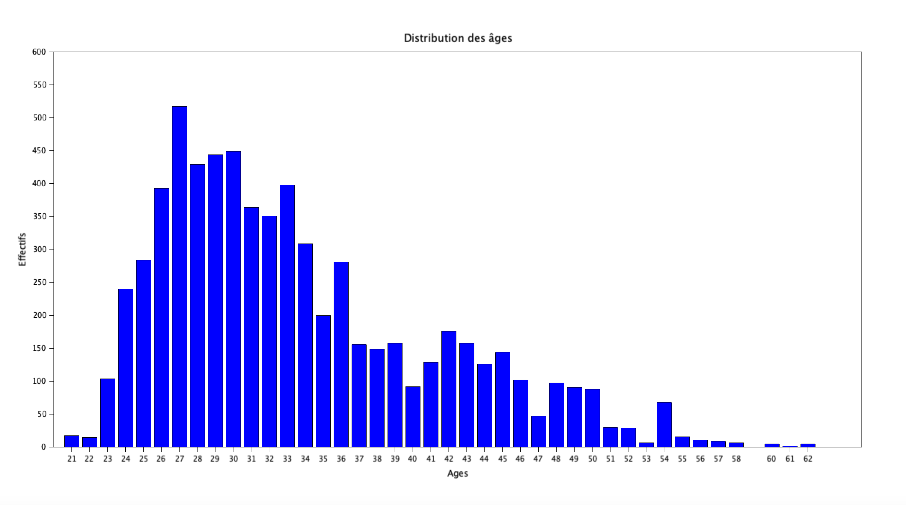
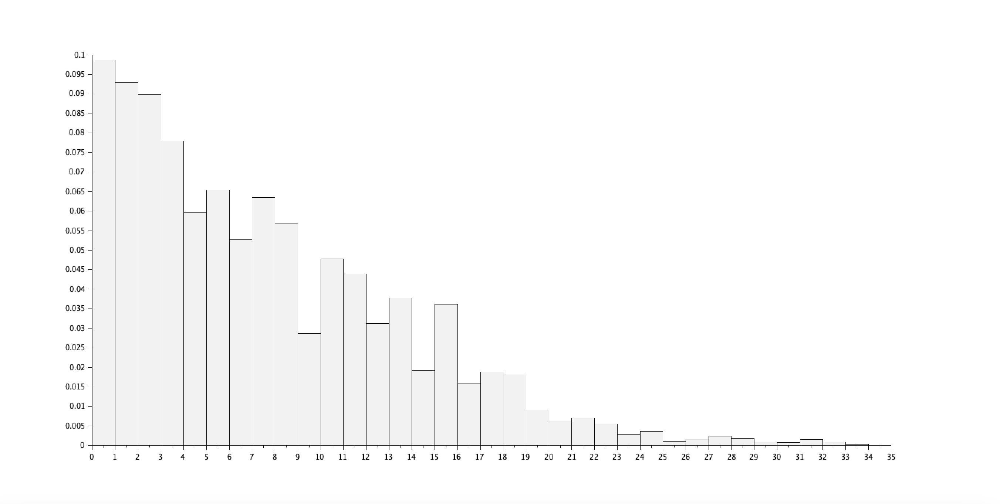
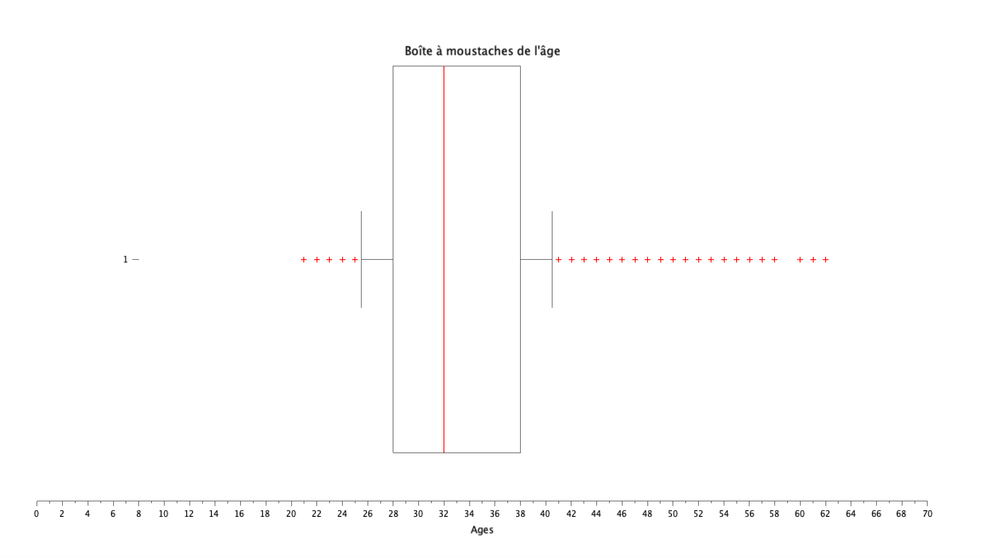
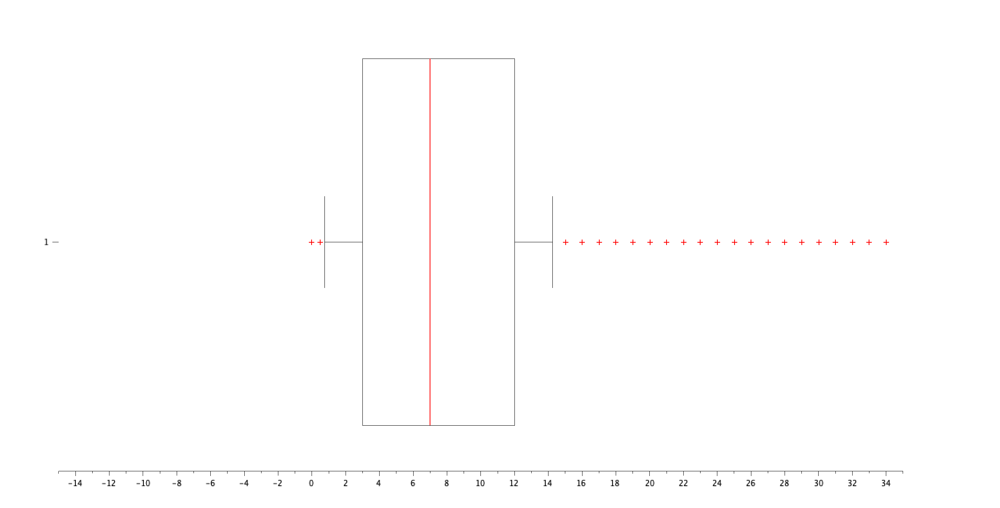

# Exercice 2 : Analyse des âges et de l'expérience

## Table des matières
1. [Initialisation des variables](#init)
2. [Distribution des âges](#q1)
3. [Distribution de l'expérience](#q2)
4. [Statistiques descriptives pour l'âge](#q3)
5. [Boîte à moustaches pour l'âge](#q4)
6. [Statistiques descriptives et boîte à moustaches pour l'expérience](#q5)

---

## Initialisation des variables {#init}

Pour cette exercice, veuillez initaliser les variables suivantes :

**[Script Scilab](scripts/init.sce) :**

```scilab
csvDouble = csvRead("data.csv");                         //ouvre data.csv en une matrice d'entier
csvString = csvRead("data.csv",[],[],'string');          //ouvre data.csv en une matrice de string
```

---

## Question 1 : Distribution des âges {#q1}

> Donnez sous forme d'histogramme la distribution des âges.

**[Script Scilab](scripts/q1.sce) :**

```scilab
ages = tabul(csvDouble(:,2));
bar(ages(:,1),ages(:,2));
```

**Résultat :**



---

## Question 2 : Distribution de l'expérience {#q2}

> Donnez sous forme d'histogramme la distribution de l'expérience.

**[Script Scilab](scripts/q2.sce) :**

```scilab
exp = tabul(csvDouble(:,6));
bar(exp(:,1),exp(:,2));
```

**Résultat :**



---

## Question 3 : Statistiques descriptives pour l'âge {#q3}

> Donnez les quartiles, interquartiles, min, max, moyenne, médiane, mode, et écart type de l'âge.

**[Script Scilab](scripts/q3.sce) :**

```scilab
mean(csvDouble(:,2))        //moyenne
min(csvDouble(:,2))         //min
max(csvDouble(:,2))         //max
median(csvDouble(:,2))      //médianne
quart(csvDouble(:,2))       //quartile
iqr(csvDouble(:,2))         //interquartile
stdev(csvDouble(:,2))       //ecart-type

age = tabul(csvDouble(:,2));
[occurence_tri,indice_tri] = gsort(age(:,2));
liste_age = age(:,1);
mode = liste_age(indice_tri(1))        //mode
```
**Résultat :**

- Quartiles : [28, 32, 38]
- Interquartile Range (IQR) : Q(3) - Q(1) = 10
- Minimum : 21
- Maximum : 62
- Moyenne : 33.622033
- Médiane : 32
- Mode : 27
- Écart type de l'âge : 7.6156456

---

## Question 4 : Boîte à moustaches pour l'âge {#q4}

> A l'aide du paquet stixbox, tracez une boîte à moustaches pour l'âge.

**[Script Scilab](scripts/q4.sce) :**

```scilab
// Installation de stibox
atomsInstall("stixbox")

// Lancement de stibox
atomsLoad("stixbox")

// Utilisation de stibox
boxplot(csvDouble(:,2),"whisker",0.25,"orientation","horizontal");
```
**Résultat :**



---

## Question 5 : Statistiques descriptives et boîte à moustaches pour l'expérience {#q5}

> Refaire les questions précédentes pour l'expérience.

**[Script Scilab](scripts/q5.sce) :**

```scilab
mean(csvDouble(:,6))        //moyenne
min(csvDouble(:,6))         //min
max(csvDouble(:,6))         //max
median(csvDouble(:,6))      //médianne
quart(csvDouble(:,6))       //quartile
iqr(csvDouble(:,6))         //interquartile
stdev(csvDouble(:,6))       //ecart-type

exp = tabul(csvDouble(:,6))
[occurence_tri,indice_tri] = gsort(exp(:,2))
liste_exp = exp(:,1)
mode = liste_exp(33)        //mode

atomsInstall("stixbox")
atomsLoad("stixbox")
boxplot(csvDouble(:,6),"whisker",0.25,"orientation","horizontal")
```
**Résultat :**

- Quartiles : [3, 7, 12]
- Interquartile : Q(3) - Q(1) = 9
- Minimum : 0
- Maximum : 34
- Moyenne : 8.0950142
- Médiane : 7
- Mode : 2
- Écart type : 6.0598534

- 


---

[⬅️](../EXO1/ "Exercice précédent (Exercice 1)") | [🏠](../ "Retour au sommaire") | [➡️](../EXO3/ "Exercice suivant (Exercice 3)")