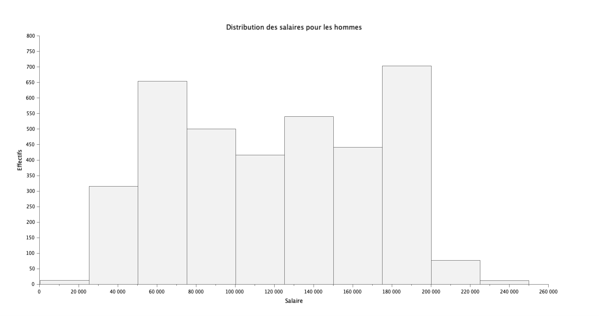
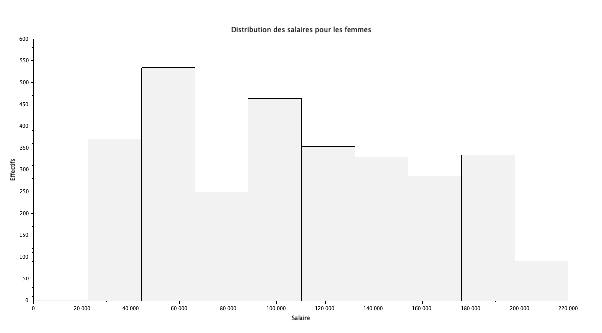
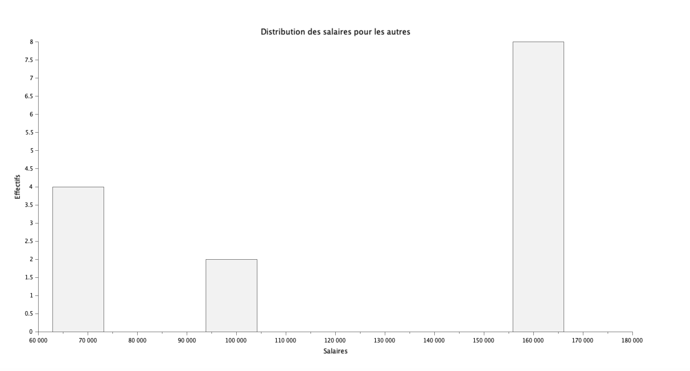
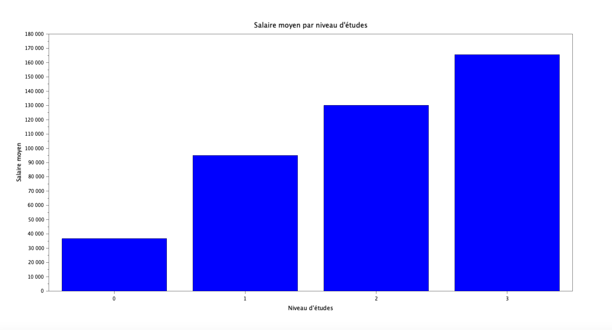
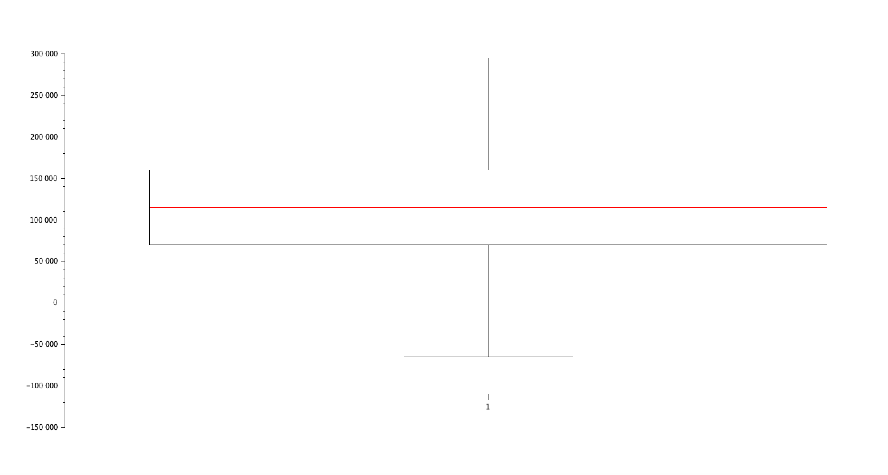
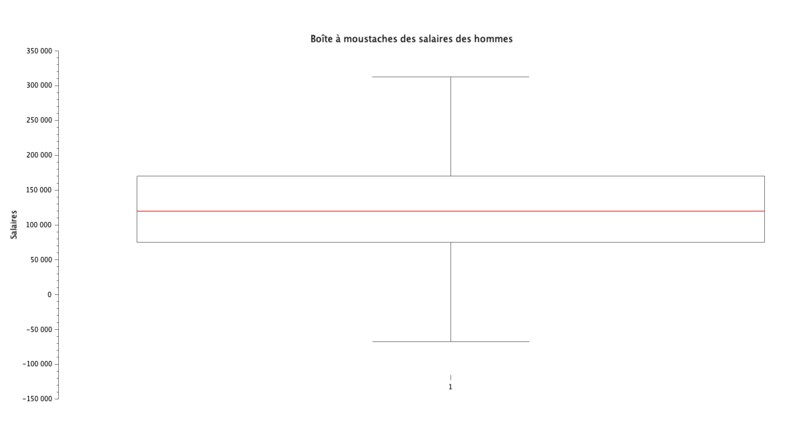
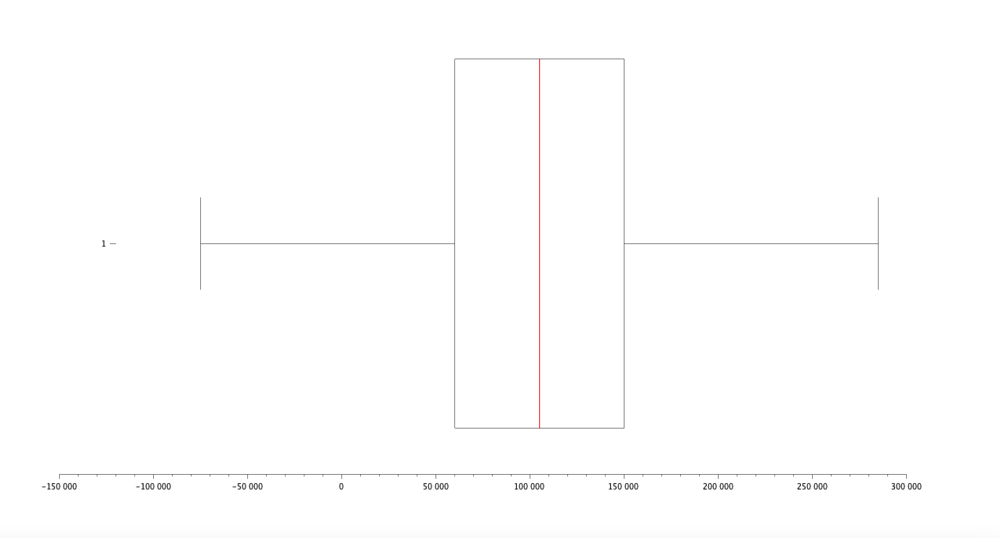
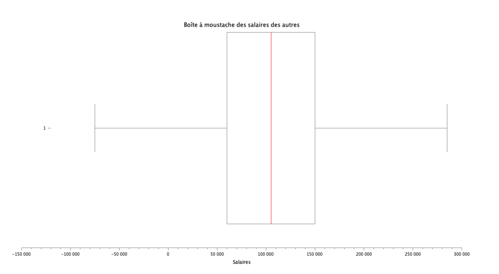

# Exercice 3 : Analyse des salaires

## Table des matières
1. [Initialisation des variables](#init)
2. [Distribution des salaires par genre](#q1)
3. [Histogramme des salaires moyens par niveau d'études](#q2)
4. [Statistiques descriptives des salaires](#q3)
5. [Répartition des salaires par genre](#q4)

---

## Initialisation des variables {#init}

Pour cette exercice, veuillez initaliser les variables suivantes :

**[Script Scilab](scripts/init.sce) :**

```scilab
csvDouble = csvRead("data.csv");                         //ouvre data.csv en une matrice d'entier
csvString = csvRead("data.csv",[],[],'string');          //ouvre data.csv en une matrice de string
```

---

## Question 1 : Distribution des salaires par genre {#q1}

> Donnez, sous forme d'histogramme, la distribution des salaires suivant le genre.

**[Script Scilab - hommes](scripts/q1-homme.sce) :**

```scilab
id_male = find(csvString(:,3) == "Male" );
salaire_male = csvDouble(id_male,7);
histplot(10,salaire_male,normalization=%f);
xlabel('Salaire');
ylabel('Effectifs');
title('Distribution des salaires pour les hommes');
```

**[Script Scilab - femmes](scripts/q1-femme.sce) :**

```scilab
id_female = find(csvString(:,3) == "Female" );
salaire_female = csvDouble(id_female,7);
histplot(10,salaire_female,normalization=%f);
xlabel('Salaire');
ylabel('Effectifs');
title('Distribution des salaires pour les femmes');
```

**[Script Scilab - autres](scripts/q1-autres.sce) :**

```scilab
id_other = find(csvString(:,3) == "Other" );
salaire_other = csvDouble(id_other,7);
histplot(10,salaire_other,normalization=%f);
xlabel('Salaires');
ylabel('Effectifs');
title('Distribution des salaires pour les autres');
```

**Résultat :**

Hommes : 


Femmes : 


Autres : 


---

## Question 2 : Histogramme des salaires moyens par niveau d'études {#q2}

> Tracez un histogramme des salaires moyens suivant le niveau d'études.

**[Script Scilab](scripts/q2.sce) :**

```scilab
indice_high = find(csvDouble(:,4) == 0 );
salaire_high = csvDouble(indice_high,7);
moy_h = mean(salaire_high);                             


indice_b = find(csvDouble(:,4) == 1 );
salaire_b = csvDouble(indice_b,7);
moy_b = mean(salaire_b);                                         


indice_m = find(csvDouble(:,4) == 2 );
salaire_m = csvDouble(indice_m,7);
moy_m = mean(salaire_m);                                         


indice_p = find(csvDouble(:,4) == 3);
salaire_p = csvDouble(indice_p,7);
moy_p = mean(salaire_p);                                         


matrice = [moy_h,moy_b,moy_m,moy_p];
bar([0,1,2,3],matrice);

xlabel("Niveau d''études");
ylabel("Salaire moyen");
title("Salaire moyen par niveau d''études");
```

**Résultat :**



---

## Question 3 : Statistiques descriptives des salaires {#q3}

> Donnez les quartiles, interquartiles, minimum, maximum, moyenne, médiane, et écart-type des salaires. Tracez une boîte à moustaches.

**[Script Scilab](scripts/q3.sce) :**

```scilab
mean(csvDouble(:,7))        //moyenne
min(csvDouble(:,7))         //min
max(csvDouble(:,7))         //max
median(csvDouble(:,7))      //médianne
quart(csvDouble(:,7))       //quartile
iqr(csvDouble(:,7))         //interquartile
stdev(csvDouble(:,7))       //ecart-type

sal = tabul(csvDouble(:,7));
[occurence_tri,indice_tri] = gsort(sal(:,2));
liste_exp = sal(:,1);
mode = liste_exp(indice_tri(1))        //mode

atomsLoad("stixbox");
boxplot(csvDouble(:,7),"orientation","horizontal");
xlabel('Salaires');
title('Boîte à moustache des salaires');
```
**Résultat :**

- Quartiles : [Q1, Q2 (médiane), Q3] = [70000, 115000, 160000]
- Interquartile Range (IQR) : Q(3) - Q(1) = 90000
- Minimum : 350
- Maximum : 250000
- Moyenne : 115326.96
- Médiane : 115000
- Mode : 140000
- Écart-type : 52786.184



---

## Question 4 : Répartition des salaires par genre {#q4}

> Refaire la question précédente, en distinguant les genres. Tracez une boîte à moustache pour chaque genre. Commentaires ?

**[Script Scilab - Autres](scripts/q4-autres.sce) :**

```scilab
id_other = find(csvString(:,3) == "Other" )
salaire_other = csvDouble(id_other,7)
mean(salaire_other)        //moyenne
min(salaire_other)         //min
max(salaire_other)         //max
median(salaire_other)      //médianne
quart(salaire_other)       //quartile
iqr(salaire_other)         //interquartile
stdev(salaire_other)       //ecart-type
sal = tabul(salaire_other);
[occurence_tri,indice_tri] = gsort(sal(:,2));
liste_sal = sal(:,1);
mode = liste_sal(indice_tri(1))        //mode
boxplot(salaire_other,"orientation","horizontal")
xlabel('Salaires');
title('Boîte à moustache des salaires des autres');
```

**[Script Scilab - Femmes](scripts/q4-femme.sce) :**

```scilab
id_female = find(csvString(:,3) == "Female" )
salaire_female = csvDouble(id_female,7)
mean(salaire_female)        //moyenne
min(salaire_female)         //min
max(salaire_female)         //max
median(salaire_female)      //médianne
quart(salaire_female)       //quartile
iqr(salaire_female)         //interquartile
stdev(salaire_female)       //ecart-type
sal = tabul(salaire_female);
[occurence_tri,indice_tri] = gsort(sal(:,2));
liste_sal = sal(:,1);
mode = liste_sal(indice_tri(1))        //mode
boxplot(salaire_female,"orientation","horizontal")
xlabel('Salaires');
title('Boîte à moustache des salaires des femmes');
```

**[Script Scilab - Hommes](scripts/q4-homme.sce) :**

```scilab
id_male = find(csvString(:,3) == "Male" )
salaire_male = csvDouble(id_male,7)
mean(salaire_male)        //moyenne
min(salaire_male)         //min
max(salaire_male)         //max
median(salaire_male)      //médianne
quart(salaire_male)       //quartile
iqr(salaire_male)         //interquartile
stdev(salaire_male)       //ecart-type
sal = tabul(salaire_male);
[occurence_tri,indice_tri] = gsort(sal(:,2));
liste_sal = sal(:,1);
mode = liste_sal(indice_tri(1))        //mode
boxplot(salaire_male,"orientation","horizontal")
xlabel('Salaires');
title('Boîte à moustache des salaires des hommes');
```

**Résultat :**

- Hommes :

    - Quartiles : [Q1, Q2 (médiane), Q3] = [75000, 120000, 170000]
    - Interquartile Range (IQR) : QH(3) - QH(1) = 95000
    - Minimum : 350
    - Maximum : 250000
    - Moyenne : 121389.87
    - Médiane : 120000
    - Écart-type : 52092.726
    - Mode : 140000

    


- Femmes :

    - Quartiles : [Q1, Q2 (médiane), Q3] = [60000, 105000, 150000]
    - Interquartile Range (IQR) : QF(3) - QF(1) = 90000
    - Minimum : 500
    - Maximum : 220000
    - Moyenne : 107889.00
    - Médiane : 105000
    - Écart-type : 52723.610
    - Mode : 120000

    

- Autres :

    - Quartiles : [Q1, Q2 (médiane), Q3] = [69032, 158610, 161393]
    - Interquartile Range (IQR) : QF(3) - QF(1) = 92361
    - Minimum : 62852
    - Maximum : 166109
    - Moyenne : 125869.86
    - Médiane : 158610
    - Écart-type : 44242.383
    - Mode : 158966

    

- Commentaires : Les 3 diagrammes moustaches sembles être très similaires. Le placement de la médiane et des quartiles se confondent.
---

[⬅️](../EXO2/ "Exercice précédent (Exercice 2)") | [🏠](../ "Retour au sommaire") | [➡️](../EXO4/ "Exercice suivant (Exercice 4)")