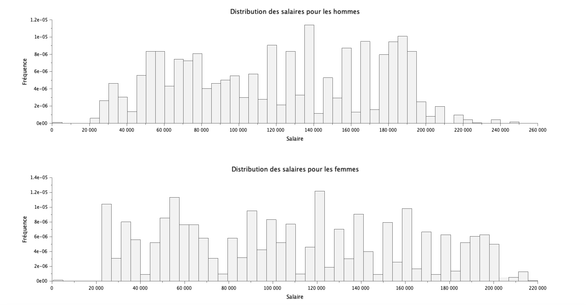

# Exercice 3 : Analyse des salaires

## Table des matières
1. [Initialisation des variables](#init)
2. [Distribution des salaires par genre](#q1)
3. [Histogramme des salaires moyens par niveau d'études](#q2)
4. [Statistiques descriptives des salaires](#q3)
5. [Répartition des salaires par genre](#q4)

---

## Initialisation des variables {#init}

Pour cette exercice, veuillez initaliser les variables suivantes :

**[Script Scilab](scripts/init.sce) :**

```scilab
D = csvRead('data.csv');
DD = csvRead('data.csv',',','.','string');
genre = DD(:,3);
```

---

## Question 1 : Distribution des salaires par genre {#q1}

> Donnez, sous forme d'histogramme, la distribution des salaires suivant le genre.

**[Script Scilab](scripts/q1.sce) :**

```scilab
D_homme = D(genre == 'Male',:);
D_femme = D(genre == 'Female',:);
salaire_homme = D_homme(:,7);
salaire_femme = D_femme(:,7);
num_bins = 50;

subplot(2, 1, 1);
histplot(num_bins, salaire_homme);
title("Distribution des salaires pour les hommes");
xlabel("Salaire");
ylabel("Fréquence");

subplot(2, 1, 2); 
histplot(num_bins, salaire_femme);
title("Distribution des salaires pour les femmes");
xlabel("Salaire");
ylabel("Fréquence");
```

**Résultat :**



---

## Question 2 : Histogramme des salaires moyens par niveau d'études {#q2}

> Tracez un histogramme des salaires moyens suivant le niveau d'études.

**[Script Scilab](scripts/q2.sce) :**

```scilab
niveau_etudes = D(:, 4);
salaires = D(:, 7);
unique_niveaux = unique(niveau_etudes);
moy_salaire_par_niveau = zeros(size(unique_niveaux));

for i = 1:length(unique_niveaux)
    moy_salaire_par_niveau(i) = mean(salaires(niveau_etudes == unique_niveaux(i)));
end

bar(unique_niveaux, moy_salaire_par_niveau);

xlabel("Niveau d''études");
ylabel("Salaire moyen");
title("Salaire moyen par niveau d''études");
```

**Résultat :**


---

## Question 3 : Statistiques descriptives des salaires {#q3}

> Donnez les quartiles, interquartiles, minimum, maximum, moyenne, médiane, et écart-type des salaires. Tracez une boîte à moustaches.

**[Script Scilab](scripts/q3.sce) :**

```scilab
Q = quart(salaires)
IQR = Q(3) - Q(1);
min_salaire = min(salaires)
max_salaire = max(salaires)
mean(salaires)
median(salaires)
stdev(salaires)
boxplot(salaires)
```
**Résultat :**

- Quartiles : [Q1, Q2 (médiane), Q3] = [70000, 115000, 160000]
- Interquartile Range (IQR) : Q(3) - Q(1);
- Minimum : 350
- Maximum : 250000
- Moyenne : 115326.96
- Médiane : 115000
- Écart-type : 52786.184


---

## Question 4 : Répartition des salaires par genre {#q4}

> Refaire la question précédente, en distinguant les genres. Tracez une boîte à moustache pour chaque genre. Commentaires ?

**[Script Scilab](scripts/q4.sce) :**

```scilab
pie([surfaceAfrique, surfaceAmeriqueDuNord, surfaceAmeriqueDuSud, surfaceAsie, surfaceEurope, surfaceOceanie])

pie([populationAfrique, populationAmeriqueDuNord, populationAmeriqueDuSud, populationAsie, populationEurope, populationOceanie])
```

**Résultat :**


