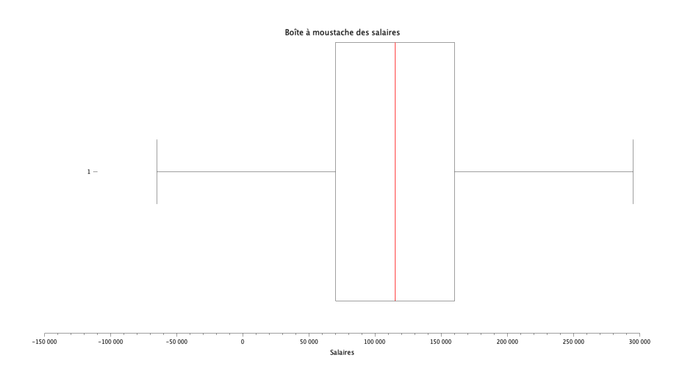

# Exercice 3 : Analyse des salaires

## Table des matières
1. [Initialisation des variables](#init)
2. [Distribution des salaires par genre](#q1)
3. [Histogramme des salaires moyens par niveau d'études](#q2)
4. [Statistiques descriptives des salaires](#q3)
5. [Répartition des salaires par genre](#q4)

---

## Initialisation des variables {#init}

Pour cette exercice, veuillez initaliser les variables suivantes :

**[Script Scilab](scripts/init.sce) :**

```scilab
csvDouble = csvRead("data.csv")                         //ouvre data.csv en une matrice d'entier
csvString = csvRead("data.csv",[],[],'string')          //ouvre data.csv en une matrice de string
```

---

## Question 1 : Distribution des salaires par genre {#q1}

> Donnez, sous forme d'histogramme, la distribution des salaires suivant le genre.

**[Script Scilab - hommes](scripts/q1-homme.sce) :**

```scilab
id_male = find(csvString(:,3) == "Male" )
salaire_male = csvDouble(id_male,7)
histplot(10,salaire_male,normalization=%f)
```

**[Script Scilab - femmes](scripts/q1-femme.sce) :**

```scilab
id_female = find(csvString(:,3) == "Female" )
salaire_female = csvDouble(id_female,7)
histplot(10,salaire_female,normalization=%f)
```

**[Script Scilab - autres](scripts/q1-autres.sce) :**

```scilab
id_other = find(csvString(:,3) == "Other" )
salaire_other = csvDouble(id_other,7)
histplot(10,salaire_other,normalization=%f)
```

**Résultat :**

Hommes : 


Femmes : 


Autres : 


---

## Question 2 : Histogramme des salaires moyens par niveau d'études {#q2}

> Tracez un histogramme des salaires moyens suivant le niveau d'études.

**[Script Scilab](scripts/q2.sce) :**

```scilab
indice_high = find(csvDouble(:,4) == 0 )
salaire_high = csvDouble(indice_high,7)
moy_h = mean(salaire_high)                                      


indice_b = find(csvDouble(:,4) == 1 )
salaire_b = csvDouble(indice_b,7)
moy_b = mean(salaire_b)                                         


indice_m = find(csvDouble(:,4) == 2 )
salaire_m = csvDouble(indice_m,7)
moy_m = mean(salaire_m)                                         


indice_p = find(csvDouble(:,4) == 3)
salaire_p = csvDouble(indice_p,7)
moy_p = mean(salaire_p)                                         


matrice = [moy_h,moy_b,moy_m,moy_p]
bar([0,1,2,3],matrice)

xlabel("Niveau d''études");
ylabel("Salaire moyen");
title("Salaire moyen par niveau d''études");
```

**Résultat :**


---

## Question 3 : Statistiques descriptives des salaires {#q3}

> Donnez les quartiles, interquartiles, minimum, maximum, moyenne, médiane, et écart-type des salaires. Tracez une boîte à moustaches.

**[Script Scilab](scripts/q3.sce) :**

```scilab
mean(csvDouble(:,7))        //moyenne
min(csvDouble(:,7))         //min
max(csvDouble(:,7))         //max
median(csvDouble(:,7))      //médianne
quart(csvDouble(:,7))       //quartile
iqr(csvDouble(:,7))         //interquartile
stdev(csvDouble(:,7))       //ecart-type

sal = tabul(csvDouble(:,7));
[occurence_tri,indice_tri] = gsort(sal(:,2));
liste_exp = sal(:,1);
mode = liste_exp(200)        //mode

atomsLoad("stixbox")
boxplot(csvDouble(:,7),"orientation","horizontal")
```
**Résultat :**

- Quartiles : [Q1, Q2 (médiane), Q3] = [70000, 115000, 160000]
- Interquartile Range (IQR) : Q(3) - Q(1) = 90000
- Minimum : 350
- Maximum : 250000
- Moyenne : 115326.96
- Médiane : 115000
- Mode : 140000
- Écart-type : 52786.184



---

## Question 4 : Répartition des salaires par genre {#q4}

> Refaire la question précédente, en distinguant les genres. Tracez une boîte à moustache pour chaque genre. Commentaires ?

**[Script Scilab](scripts/q4.sce) :**

```scilab
MARCO ???
MARCO ???
MARCO ???
MARCO ???
MARCO ???
MARCO ???


MARCO ???
MARCO ???MARCO ???MARCO ???
MARCO ???
MARCO ???
MARCO ???
```

**Résultat :**

- Hommes :

    - Quartiles : [Q1, Q2 (médiane), Q3] = [..., ..., ...]
    - Interquartile Range (IQR) : QH(3) - QH(1) = ...
    - Minimum : ...
    - Maximum : ...
    - Moyenne : ...
    - Médiane : ...
    - Écart-type : ...

    


- Femmes :

    - Quartiles : [Q1, Q2 (médiane), Q3] = [..., ..., ...]
    - Interquartile Range (IQR) : QF(3) - QF(1) = ...
    - Minimum : ...
    - Maximum : ...
    - Moyenne : ...
    - Médiane : ...
    - Écart-type : ...

    

- Femmes :

    - Quartiles : [Q1, Q2 (médiane), Q3] = [..., ..., ...]
    - Interquartile Range (IQR) : QF(3) - QF(1) = ...
    - Minimum : ...
    - Maximum : ...
    - Moyenne : ...
    - Médiane : ...
    - Écart-type : ...

    

- Commentaires : 
...

---

[⬅️](../EXO2/ "Exercice précédent (Exercice 2)") | [🏠](../ "Retour au sommaire") | [➡️](../EXO4/ "Exercice suivant (Exercice 4)")