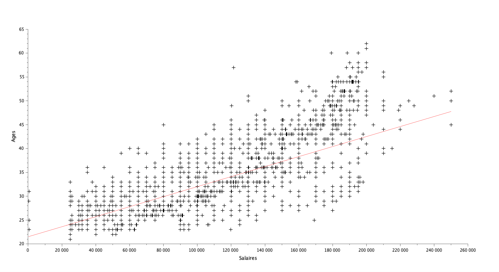
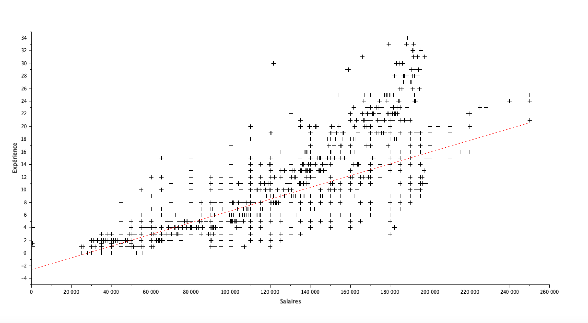

# Exercice 4 : Analyse de la relation entre âge, expérience et salaire

## Table des matières
1. [Initialisation des variables](#init)
2. [Nuage de points et régression linéaire : Age vs Salaire](#q1)
3. [Nuage de points et régression linéaire : Expérience vs Salaire](#q2)

---

## Initialisation des variables {#init}

Pour cette exercice, veuillez initaliser les variables suivantes :

**[Script Scilab](scripts/init.sce) :**

```scilab
csvDouble = csvRead('data.csv');   
csvString = csvRead('data.csv',[],[],'string');
```

---

## Question 1 : Nuage de points et régression linéaire (Age vs Salaire) {#q1}

> Tracez un nuage de points (age,salaire), et la droite de regression correspondante. Quel est le coefficient de corrélation ?

**[Script Scilab](scripts/q1.sce) :**

```scilab
X=csvDouble(:,7);
Y=csvDouble(:,2);
plot2d(X,Y,-1);
[a,b] = reglin(X',Y');
y_reg = a*X+b;
plot2d(X,y_reg,5);
corrcoef(X,Y)
```

**Résultat :**

- Coefficient de corrélation : 0.7280526
- 

---

## Question 2 : Nuage de points et régression linéaire : Expérience vs Salaire {#q2}

> Tracez un nuage de points (expérience,salaire), et la droite de regression correspondante. Quel est le coefficient de corrélation ?

**[Script Scilab](scripts/q2.sce) :**

```scilab
X=csvDouble(:,7);
Y=csvDouble(:,6);
plot2d(X,Y,-1);
[a,b] = reglin(X',Y');
y_reg = a*X+b;
plot2d(X,y_reg,5);
corrcoef(X,Y)
```

**Résultat :**

- Coefficient de corrélation : 0.8089689
- 


---

[⬅️](../EXO3/ "Exercice précédent (Exercice 3)") | [🏠](../ "Retour au sommaire") | [➡️](../EXO5/ "Exercice suivant (Exercice 5)")