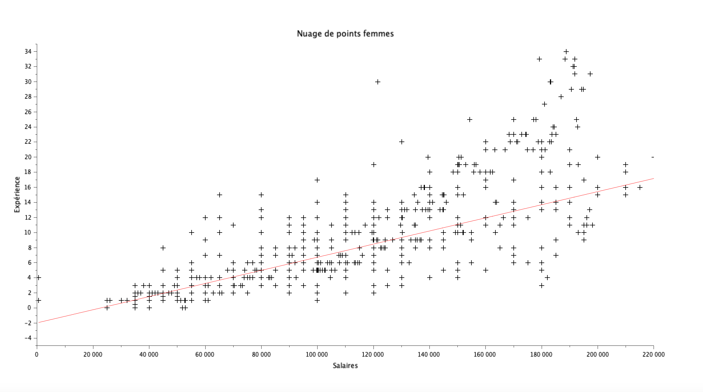

# Exercice 5 : Analyse de la relation entre expérience et salaire par genre et niveau d'études

## Table des matières
1. [Initialisation des variables](#init)
2. [Nuage de points et régression linéaire : Expérience vs Salaire par genre](#q1)
3. [Nuage de points et régression linéaire : Expérience vs Salaire par niveau d'études](#q2)

---

## Initialisation des variables {#init}

Pour cette exercice, veuillez initaliser les variables suivantes :

**[Script Scilab](scripts/init.sce) :**

```scilab
csvDouble = csvRead("data.csv")                         //ouvre data.csv en une matrice d'entier
csvString = csvRead("data.csv",[],[],'string')          //ouvre data.csv en une matrice de string
```

---

## Question 1 : Nuage de points et régression linéaire : Expérience vs Salaire par genre {#q1}

> Tracez un nuage de points (salaire,expérience) pour les hommes et les femmes, ainsi que les droites de regression associées. Commentaire ?

**[Script Scilab - Hommes](scripts/q1-homme.sce) :**

```scilab
id_male = find(csvString(:,3) == "Male" )
salaire_male = csvDouble(id_male,7)
exp_male = csvDouble(id_male,6)
plot2d(salaire_male,exp_male,-1)
[a,b] = reglin(salaire_male',exp_male')
y_reg = a*salaire_male+b
plot2d(salaire_male,y_reg,5)
```

**[Script Scilab - Femmes](scripts/q1-femme.sce) :**

```scilab
id_female = find(csvString(:,3) == "Female" )
salaire_female = csvDouble(id_female,7)
exp_female = csvDouble(id_female,6)
plot2d(salaire_female,exp_female,-1)
[a,b] = reglin(salaire_female',exp_female')
y_reg = a*salaire_female+b
plot2d(salaire_female,y_reg,5)
```

**Résultat :**

- Nuage de points - Hommes :


- Nuage de points - Femmes :


- Commentaire : 

---

## Question 2 : Nuage de points et régression linéaire : Expérience vs Salaire par niveau d'études {#q2}

> Tracez un nuage de points (salaire,expérince) et les droites de regression associées pour chaque niveau d'études. Commentaire ?

**[Script Scilab - Niveau d'étude n°1](scripts/q2-1.sce) :**

```scilab
indice_high = find(csvDouble(:,4) == 0 )
salaire_high = csvDouble(indice_high,7)
exp_high = csvDouble(indice_high,6)
plot2d(salaire_high,exp_high,-1)
[a,b] = reglin(salaire_high',exp_high')
y_reg = a*salaire_high+b
plot2d(salaire_high,y_reg,5)
```

**[Script Scilab - Niveau d'étude n°2](scripts/q2-2.sce) :**

```scilab
indice_b = find(csvDouble(:,4) == 1 )
salaire_b = csvDouble(indice_b,7)
exp_b = csvDouble(indice_b,6)
plot2d(salaire_b,exp_b,-1)
[a,b] = reglin(salaire_b',exp_b')
y_reg = a*salaire_b+b
plot2d(salaire_b,y_reg,5)
```

**[Script Scilab - Niveau d'étude n°3](scripts/q2-3.sce) :**

```scilab
indice_m = find(csvDouble(:,4) == 2 )
salaire_m = csvDouble(indice_m,7)
exp_m = csvDouble(indice_m,6)
plot2d(salaire_m,exp_m,-1)
[a,b] = reglin(salaire_m',exp_m')
y_reg = a*salaire_m+b
plot2d(salaire_m,y_reg,5)
```

**[Script Scilab - Niveau d'étude n°4](scripts/q2-4.sce) :**

```scilab
indice_p = find(csvDouble(:,4) == 3)
salaire_p = csvDouble(indice_p,7)
exp_p = csvDouble(indice_p,6)
plot2d(salaire_p,exp_p,-1)
[a,b] = reglin(salaire_p',exp_p')
y_reg = a*salaire_p+b
plot2d(salaire_p,y_reg,5)
```

**Résultat :**

<!-- Première paire d'images -->

<div style="display: flex; justify-content: center;">
    <div style="margin-right: 20px;">
        
        <p style="text-align: center;">Nuage de points pour le niveau d'étude n°1</p>
    </div>
    <div>
        
        <p style="text-align: center;">Nuage de points pour le niveau d'étude n°2</p>
    </div>
</div>

<!-- Deuxième paire d'images -->

<div style="display: flex; justify-content: center; margin-top: 20px;">
    <div style="margin-right: 20px;">
        
        <p style="text-align: center;">Nuage de points pour le niveau d'étude n°3</p>
    </div>
    <div>
        
        <p style="text-align: center;">Nuage de points pour le niveau d'étude n°4</p>
    </div>
</div>


- Commentaires : 

---

[⬅️](../EXO4/ "Exercice précédent (Exercice 4)") | [🏠](../ "Retour au sommaire")